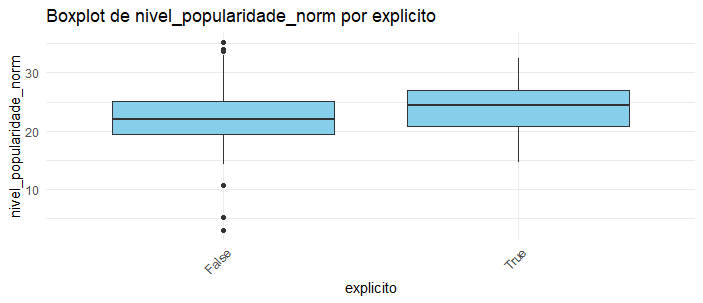
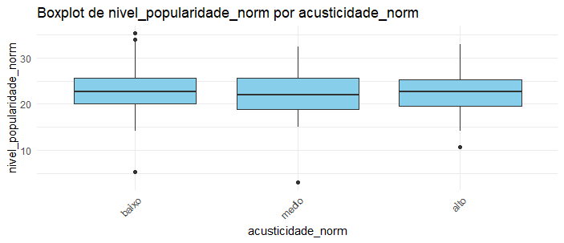

# Análise de Variância (ANOVA) e Boxplots

## O que é ANOVA?
A ANOVA é um teste estatístico que compara as médias entre três ou mais grupos para determinar se há diferenças estatisticamente significativas. Neste projeto, usamos ANOVA unidirecional para avaliar como diferentes características musicais afetam a popularidade das músicas no Spotify.

## Código Completo

```r
dataset_normalizado$explicito <- as.factor(dataset_normalizado$explicito)
dataset_normalizado$modo <- as.factor(dataset_normalizado$modo)
dataset_normalizado$compasso <- as.factor(dataset_normalizado$compasso)
dataset_normalizado$genero <- as.factor(dataset_normalizado$genero)
dataset_normalizado$tonalidade <- as.factor(dataset_normalizado$tonalidade)


identificar_nao_numericos <- function(var) {
  nao_numericos <- var[is.na(as.numeric(as.character(var)))]
  return(unique(nao_numericos))
}


vars_quantitativas <- c("acusticidade_norm", "dancabilidade_norm", "duracao_ms_norm","energia_norm", "instrumentalidade", "vivacidade_norm", "intensidade_sonora_mod", "discursividade_norm","valencia_norm", "popularidade_artista_norm","popularidade_album_norm", "ordem_no_album_norm")

for (var in vars_quantitativas) {
  print(paste("Valores não numéricos na variável", var, ":"))
  print(identificar_nao_numericos(dataset_normalizado[[var]]))
}


substituir_nao_numericos <- function(var) {
  var <- as.numeric(as.character(var))
  return(var)
}


for (var in vars_quantitativas) {
  dataset_normalizado[[var]] <- substituir_nao_numericos(dataset_normalizado[[var]])
}


dataset_normalizado <- dataset_normalizado %>% na.omit()


discretizar_var <- function(var, nome_var) {
    q1 <- quantile(var, 1/3, na.rm = TRUE)
    q2 <- quantile(var, 2/3, na.rm = TRUE)
    
    if (is.na(q1) | is.na(q2)) {
        warning(paste("Não foi possível calcular quantis para a variável", nome_var))
        return(rep(NA, length(var)))
    }
    
    if (q1 == q2) {
        q1 <- quantile(var, 0.25, na.rm = TRUE)
        q2 <- quantile(var, 0.75, na.rm = TRUE)
        
        if (q1 == q2) {
            q2 <- q1 + 1e-6
        }
    }
    
    if (length(unique(c(-Inf, q1, q2, Inf))) != 4) {
        q1 <- quantile(var, 0.2, na.rm = TRUE)
        q2 <- quantile(var, 0.8, na.rm = TRUE)
        
        if (is.na(q1) | is.na(q2)) {
            warning(paste("Não foi possível calcular quantis alternativos para a variável", nome_var))
            return(rep(NA, length(var))) 
        }
    }
    
    fator <- cut(var, breaks = c(-Inf, q1, q2, Inf), labels = c("baixo", "medio", "alto"), include.lowest = TRUE)
    return(fator)
}

for (var in vars_quantitativas) {
  dataset_normalizado[[var]] <- discretizar_var(dataset_normalizado[[var]], var)
}


variaveis <- c("explicito", "acusticidade_norm", "dancabilidade_norm", "duracao_ms_norm", "energia_norm", "instrumentalidade", "tonalidade", "vivacidade_norm", "intensidade_sonora_mod", "modo", "discursividade_norm", "compasso", "valencia_norm", "genero", "popularidade_artista_norm", "popularidade_album_norm", "ordem_no_album_norm")


resultados_anova <- list()  

for (var in variaveis) {
  formula_anova <- as.formula(paste("nivel_popularidade_norm ~", var))
  anova_model <- aov(formula_anova, data = dataset_normalizado)
  resultados_anova[[var]] <- summary(anova_model)
  
  print(paste("Resultado da ANOVA para:", var))
  print(summary(anova_model))
  
  p <- ggplot(dataset_normalizado, aes_string(x = var, y = "nivel_popularidade_norm")) +
    geom_boxplot(fill = "skyblue") +
    ggtitle(paste("Boxplot de nivel_popularidade_norm por", var)) +
    theme_minimal() +
    xlab(var) +
    ylab("nivel_popularidade_norm") +
    theme(axis.text.x = element_text(angle = 45, hjust = 1))
  
  print(p)
}

```
## Exemplo de Boxplots Gerados


