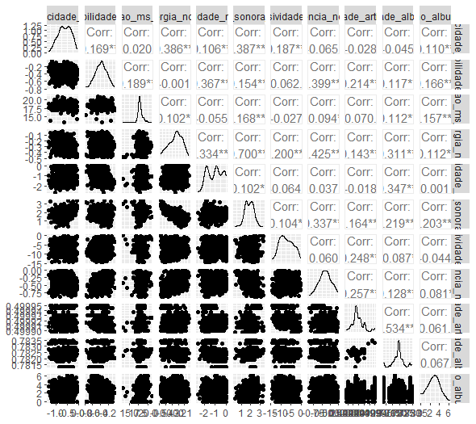

# Análise de Multicolinearidade

## O que é o Matriz de Correlação?
Uma matriz de correlação é uma tabela que exibe os coeficientes de correlação entre várias variáveis em um conjunto de dados. Ela mostra como cada par de variáveis se relaciona entre si, indicando a força e a direção dessa relação. É uma ferramenta útil para resumir grandes conjuntos de dados e identificar padrões, como multicolinearidade ou relações fortes entre variáveis. 

## O que é VIF Model ?
O Fator de Inflação de Variância (VIF) é uma medida estatística utilizada para diagnosticar a multicolinearidade em modelos de regressão. A multicolinearidade ocorre quando variáveis independentes em um modelo de regressão estão altamente correlacionadas, o que pode levar a resultados instáveis e pouco confiáveis. O VIF quantifica o grau em que a variância de um coeficiente de regressão estimado é inflacionada devido à correlação com outras variáveis preditoras. 


## Código Completo
```r
vif_model <- vif(lm(nivel_popularidade_norm ~ ., data = data_clean[, grep("_norm$", colnames(data_clean))]))
print(vif_model)

if (!require("GGally")) install.packages("GGally")
library(GGally)
ggpairs(dataset_filtrado)
```

## Resultado

