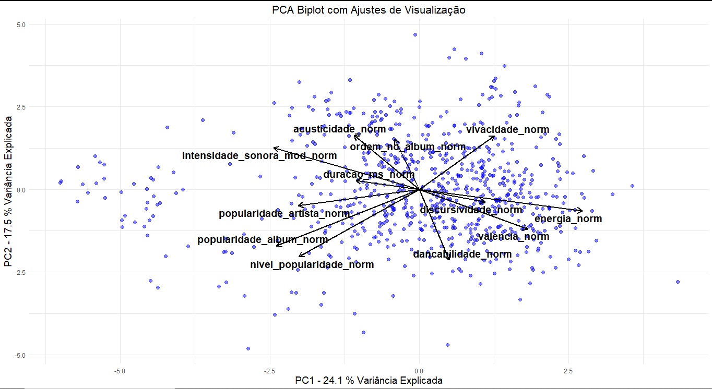

# Análise de Componentes Principais

## O que é o Análise de Componentes Principais?
A Análise de Componentes Principais (PCA) é uma técnica estatística multivariada usada para reduzir a dimensionalidade de um conjunto de dados, transformando um conjunto de variáveis possivelmente correlacionadas em um novo conjunto de variáveis não correlacionadas chamadas componentes principais. O objetivo é identificar as direções de maior variância nos dados e projetá-los nesses novos eixos, capturando a maior parte da informação original com um número menor de variáveis. 

## Código Completo
```r
variaveis_norm <- dataset[, grep("_norm$", colnames(dataset))]
pca_result <- prcomp(variaveis_norm, scale = TRUE)
print(pca_result)
library(ggplot2) 
qplot(c(1:length(variancia_explicada)), variancia_explicada) + geom_line() + xlab("Componente Principal") + ylab("Proporção de Variância Explicada") + ggtitle("Scree Plot") + ylim(0, 1)
autovalores <- pca_result$sdev^2 
autovetores <- pca_result$rotation
library(ggplot2)
library(ggrepel)
scores <- as.data.frame(pca_result$x)  # Pontuações das observações
loadings <- as.data.frame(pca_result$rotation)  # Carregamentos das variáveis
 loadings$PC1 <- loadings$PC1 * max(abs(scores$PC1))
 loadings$PC2 <- loadings$PC2 * max(abs(scores$PC2))

ggplot() +
geom_point(data = scores, aes(x = PC1, y = PC2), color = "blue", alpha = 0.5, size = 2) +
geom_segment(data = loadings, aes(x = 0, y = 0, xend = PC1, yend = PC2),
 arrow = arrow(length = unit(0.3, "cm")), color = "black", size = 1) + geom_text_repel(data = loadings, aes(x = PC1, y = PC2, label = rownames(loadings)),
 color = "black", size = 5, fontface = "bold") +
labs(title = "PCA Biplot com Ajustes de Visualização",
x = paste("PC1 -", round(summary(pca_result)$importance[2, 1] * 100, 1), "% Variância Explicada"),
y = paste("PC2 -", round(summary(pca_result)$importance[2, 2] * 100, 1), "% Variância Explicada")) +
theme_minimal() +
 theme(axis.title = element_text(size = 14),
plot.title = element_text(size = 16, hjust = 0.5))
```

## Resultados


