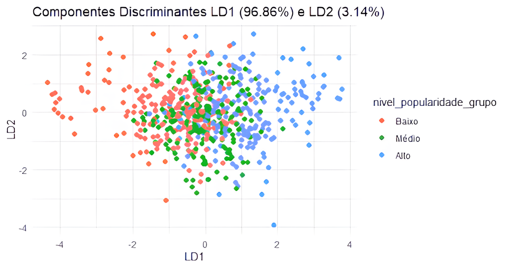
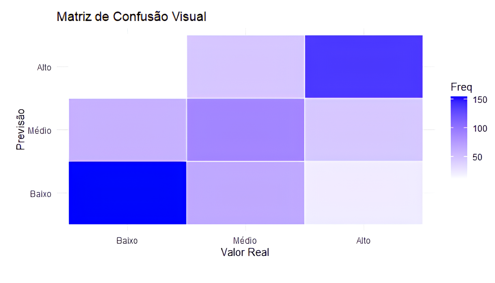
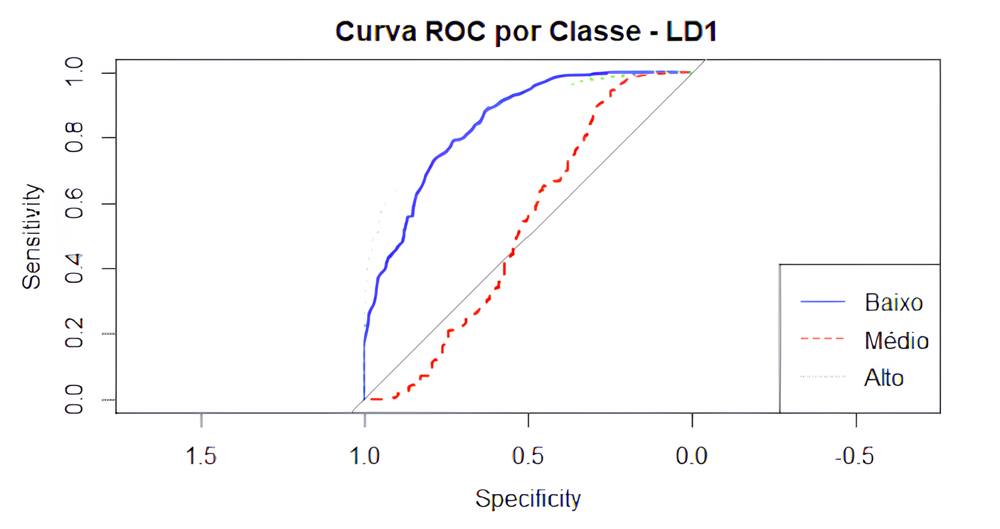
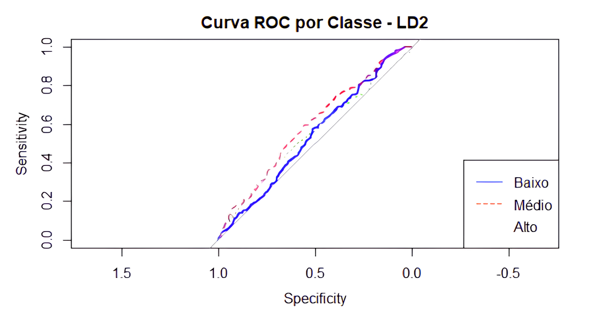

# Análise Discriminante Linear (LDA) Aprofundada

## O que é a Análise Discriminante Linear?
A Análise Discriminante Linear (LDA - Linear Discriminant Analysis) é um método estatístico usado para classificar dados em grupos distintos, encontrando uma combinação linear de características que melhor separa essas classes. É uma técnica de aprendizado supervisionado, o que significa que ela utiliza dados rotulados para treinar o modelo.

## Código Completo
```r
# Carregando pacotes necessários
library(readxl)
library(MASS)  # Para LDA
library(car)   # Para VIF
library(biotools)  # Para teste de Box's M
library(mvnormtest)  # Para teste de normalidade multivariada
library(ggplot2)

variaveis_selecionadas <- c(
  "nivel_popularidade_norm",
  "dancabilidade_norm", 
  "duracao_ms_norm",
  "energia_norm",
  "vivacidade_norm",
  "discursividade_norm",
  "popularidade_album_norm",
  "acusticidade_norm",
  "intensidade_sonora_mod_norm",
  "valencia_norm",
  "ordem_no_album_norm"
)

# Criar um novo dataset apenas com essas variáveis
dataset_filtrado <- dataset_normalizado_1_[, variaveis_selecionadas]

# Remover os valores ausentes
dataset_filtrado <- na.omit(dataset_filtrado)

outliers <- which(mahal_dist > quantile(mahal_dist, 0.85))
dataset_filtrado <- dataset_filtrado[-outliers, ]
nrow(dataset_filtrado)


# Dividir o "nivel_popularidade_norm" em 3 quantis: Baixo, Médio e Alto
dataset_filtrado$nivel_popularidade_grupo <- cut(
  dataset_filtrado$nivel_popularidade_norm,
  breaks = quantile(dataset_filtrado$nivel_popularidade_norm, probs = seq(0, 1, by = 1/3)),
  labels = c("Baixo", "Médio", "Alto"),
  include.lowest = TRUE
)

# Ajustar o modelo de LDA usando o novo grupo de popularidade
modelo_lda <- lda(nivel_popularidade_grupo ~ dancabilidade_norm + duracao_ms_norm + energia_norm + vivacidade_norm + discursividade_norm + popularidade_album_norm + acusticidade_norm +  intensidade_sonora_mod_norm +  valencia_norm + ordem_no_album_norm, data = dataset_filtrado)

# Exibir o resumo do modelo
print(modelo_lda)

# Avaliar a performance do modelo (predições)
previsoes <- predict(modelo_lda, dataset_filtrado)

# Matriz de confusão (Comparar predições com os valores reais)
matriz_confusao <- table(Previsao = previsoes$class, Real = dataset_filtrado$nivel_popularidade_grupo)
print(matriz_confusao)

# Calcular a taxa de acerto
taxa_acerto <- sum(diag(matriz_confusao)) / sum(matriz_confusao)
cat("Taxa de Acerto:", taxa_acerto * 100, "%\n")

# ---- Gráficos ----

# 1. Gráfico dos componentes discriminantes LD1 e LD2
dataset_filtrado$LD1 <- previsoes$x[,1]
dataset_filtrado$LD2 <- previsoes$x[,2]

ggplot(dataset_filtrado, aes(x = LD1, y = LD2, color = nivel_popularidade_grupo)) +
  geom_point(size = 2) +
  labs(title = "Componentes Discriminantes LD1 e LD2",
       x = "LD1", y = "LD2") +
  theme_minimal()

# 2. Heatmap da Matriz de Confusão
heatmap_data <- as.data.frame(as.table(matriz_confusao))
ggplot(heatmap_data, aes(x = Real, y = Previsao, fill = Freq)) +
  geom_tile(color = "white") +
  scale_fill_gradient(low = "white", high = "blue") +
  labs(title = "Matriz de Confusão Visual",
       x = "Valor Real", y = "Previsão") +
  theme_minimal()


# Coeficientes discriminantes para cada variável
cat("Coeficientes discriminantes das variáveis:\n")
print(modelo_lda$scaling)

# Visualizar os coeficientes dos discriminantes
print(modelo_lda$scaling)

# Proporção da variância explicada por cada discriminante
prop_var_exp <- modelo_lda$svd^2 / sum(modelo_lda$svd^2)
cat("Proporção da variância explicada por cada LD:\n", prop_var_exp, "\n")

# Adicionar a proporção ao gráfico de componentes discriminantes
ggplot(dataset_filtrado, aes(x = LD1, y = LD2, color = nivel_popularidade_grupo)) +
  geom_point(size = 2) +
  labs(title = paste0("Componentes Discriminantes LD1 (", round(prop_var_exp[1]*100, 2), "%) e LD2 (", round(prop_var_exp[2]*100, 2), "%)"),
       x = "LD1", y = "LD2") +
  theme_minimal()


# Visualizar os coeficientes dos discriminantes
print(modelo_lda$scaling)

# Proporção da variância explicada por cada discriminante
prop_var_exp <- modelo_lda$svd^2 / sum(modelo_lda$svd^2)
cat("Proporção da variância explicada por cada LD:\n", prop_var_exp, "\n")

# Adicionar a proporção ao gráfico de componentes discriminantes
ggplot(dataset_filtrado, aes(x = LD1, y = LD2, color = nivel_popularidade_grupo)) +
  geom_point(size = 2) +
  labs(title = paste0("Componentes Discriminantes LD1 (", round(prop_var_exp[1]*100, 2), "%) e LD2 (", round(prop_var_exp[2]*100, 2), "%)"),
       x = "LD1", y = "LD2") +
  theme_minimal()

# Coeficientes discriminantes para cada variável
cat("Coeficientes discriminantes das variáveis:\n")
print(modelo_lda$scaling)

# Plotar importância das variáveis
library(reshape2)
coef_df <- as.data.frame(modelo_lda$scaling)
coef_df$Variavel <- rownames(coef_df)
coef_melt <- melt(coef_df, id.vars = "Variavel")

ggplot(coef_melt, aes(x = Variavel, y = value, fill = variable)) +
  geom_bar(stat = "identity", position = "dodge") +
  labs(title = "Importância das Variáveis nos Componentes Discriminantes",
       x = "Variáveis", y = "Coeficientes") +
  theme_minimal() +
  theme(axis.text.x = element_text(angle = 45, hjust = 1))

# Previsões com Validação Cruzada (usar CV = TRUE)
previsoes_cv <- predict(modelo_lda, dataset_filtrado, CV = TRUE)

# Matriz de confusão (validação cruzada)
matriz_confusao_cv <- table(Previsao = previsoes_cv$class, Real = dataset_filtrado$nivel_popularidade_grupo)
print(matriz_confusao_cv)

# Calcular a taxa de acerto da validação cruzada
taxa_acerto_cv <- sum(diag(matriz_confusao_cv)) / sum(matriz_confusao_cv)
cat("Taxa de Acerto com Validação Cruzada:", taxa_acerto_cv * 100, "%\n")

# Calcular os Scores-Z discriminantes para cada componente discriminante
dataset_filtrado$Z_LD1 <- scale(dataset_filtrado$LD1)
dataset_filtrado$Z_LD2 <- scale(dataset_filtrado$LD2)

# Exibir os primeiros valores
head(dataset_filtrado[, c("LD1", "LD2", "Z_LD1", "Z_LD2")])


# Comparar as médias dos Scores-Z entre os grupos
library(dplyr)

media_scores_z <- dataset_filtrado %>%
  group_by(nivel_popularidade_grupo) %>%
  summarise(
    Media_Z_LD1 = mean(Z_LD1),
    Media_Z_LD2 = mean(Z_LD2)
  )

print(media_scores_z)

# Fazer o teste ANOVA para comparar as médias
anova_LD1 <- aov(Z_LD1 ~ nivel_popularidade_grupo, data = dataset_filtrado)
anova_LD2 <- aov(Z_LD2 ~ nivel_popularidade_grupo, data = dataset_filtrado)

summary(anova_LD1)
summary(anova_LD2)

# Instalar pacote 'caret' para métricas detalhadas de avaliação
library(caret)

# Avaliar as métricas de precisão preditiva
precisao <- confusionMatrix(matriz_confusao)
print(precisao)

# Para a validação cruzada
precisao_cv <- confusionMatrix(matriz_confusao_cv)
print(precisao_cv)

# Instalar pacote 'pROC' para Curva ROC e AUC
library(pROC)

# Converter as classes para fatores numéricos (necessário para o pROC)
dataset_filtrado$grupo_num <- as.numeric(factor(dataset_filtrado$nivel_popularidade_grupo))

# Gerar ROC para LD1 (multiclasse)
roc_lda <- multiclass.roc(dataset_filtrado$grupo_num, dataset_filtrado$LD1)

# Extrair as curvas ROC individuais
roc_curves <- roc_lda$rocs

# Plotar cada uma das curvas ROC para as diferentes classes
plot(roc_curves[[1]], col = "blue", main = "Curva ROC Multiclasse - LD1")
for(i in 2:length(roc_curves)) {
  plot(roc_curves[[i]], col = i, add = TRUE)  # Adiciona as outras curvas no mesmo gráfico
}

# Adicionar uma legenda para diferenciar as classes
legend("bottomright", legend = paste("Classe", 1:length(roc_curves)), col = 1:length(roc_curves), lty = 1)
```

## Resultados




