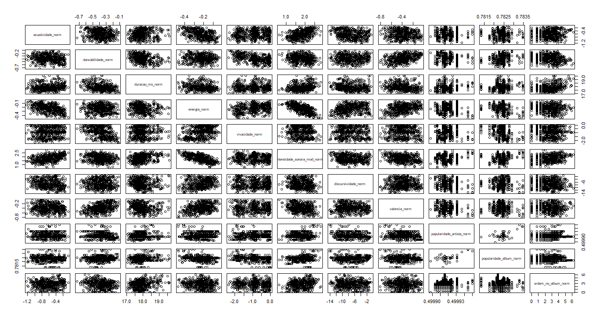

# Diagnóstico de Resíduos em Modelos Parciais

## O que é o Gráfico de Resíduos vs Ajustados?
O gráfico de resíduos versus ajustados é uma ferramenta visual usada em análise estatística para avaliar a qualidade do ajuste de um modelo de regressão. Ele mostra os resíduos (a diferença entre os valores observados e os valores previstos pelo modelo) em relação aos valores previstos. A análise desse gráfico ajuda a identificar padrões ou não conformidades com as suposições do modelo de regressão, como linearidade, homocedasticidade e independência dos resíduos.

## O que é o Gráfico de correlação entre as variáveis independentes ?
Um gráfico de dispersão (ou gráfico de correlação) é usado para visualizar a relação entre duas variáveis independentes. Ele mostra os pontos de dados como um conjunto de coordenadas (x, y), onde cada ponto representa um par de valores das duas variáveis. A análise desses pontos pode revelar padrões de correlação, indicando se as variáveis tendem a variar juntas (correlação positiva), se uma variável tende a diminuir à medida que a outra aumenta (correlação negativa), ou se não há uma relação clara (correlação nula). 


## Código Completo
```r
variaveis <- c("dancabilidade_norm", 
               "duracao_ms_norm",
               "energia_norm",
               "vivacidade_norm",
               "discursividade_norm",
               "popularidade_album_norm",
               "acusticidade_norm",
               "intensidade_sonora_mod_norm",
               "valencia_norm",
               "ordem_no_album_norm")
for (var in variaveis) {
    formula_modelo <- as.formula(paste("nivel_popularidade_norm ~", var))
    modelo <- lm(formula_modelo, data = dataset_filtrado)
    plot(modelo, which = 1, main = paste("Resíduos vs Ajustados para:", var))
}

```

## Resultado

