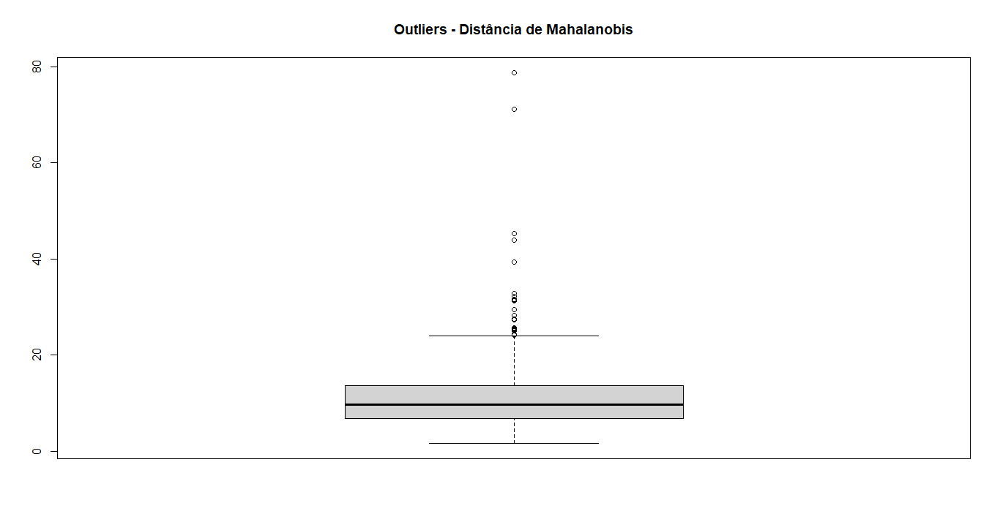
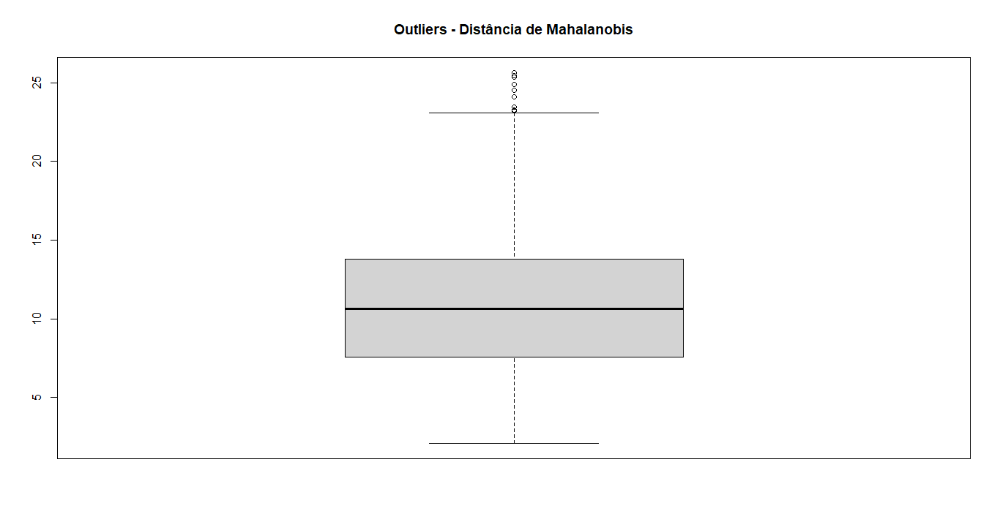

# Distância de Mahalanobis para Detecção de Outliers Multivariados

## O que é Distância de Mahalanobis?
Diferente da distância euclidiana, a distância de Mahalanobis é uma medida estatística que determina o quão distante um ponto está do centro de uma distribuição multivariada, neste caso ele foi usado para identificar os outliers do dataset e remover os mais distantes da distribuição.

## Código Completo
 ```r
variaveis_selecionadas <- c(
   "nivel_popularidade_norm",
  "dancabilidade_norm", 
  "duracao_ms_norm",
  "energia_norm",
  "vivacidade_norm",
  "discursividade_norm",
  "popularidade_album_norm",
  "acusticidade_norm",
  "intensidade_sonora_mod_norm",
  "valencia_norm",
  "ordem_no_album_norm"
)

dataset_filtrado <- dataset[, variaveis_selecionadas]
dataset_filtrado <- dataset_filtrado[, colnames(dataset_filtrado) != "nivel_popularidade_norm"]
mahal_dist <- mahalanobis(dataset_filtrado, colMeans(dataset_filtrado), cov(dataset_filtrado))
x11()
boxplot(mahal_dist, main = "Outliers - Distância de Mahalanobis")
```

## Outliers apresentados


## Remoção de uma parcela dos outliers
Foi removido os dados mais distantes da distribuição para obter resultados melhores de curtose e assimetria do teste de mardia (Mardia Skewness e Mardia Kurtosis).

## Código Completo
 ```r
outliers <- which(mahal_dist > quantile(mahal_dist, 0.975))
dataset_filtrado <- dataset_filtrado[-outliers, ]
nrow(dataset_filtrado)
```
## Boxplot após a remoção de uma parcela de outliers


